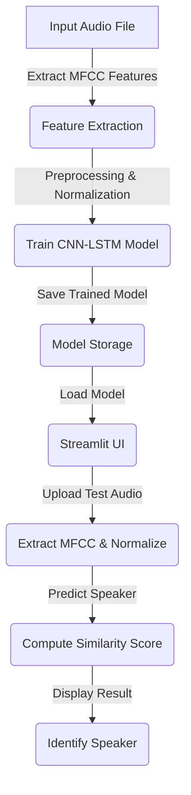
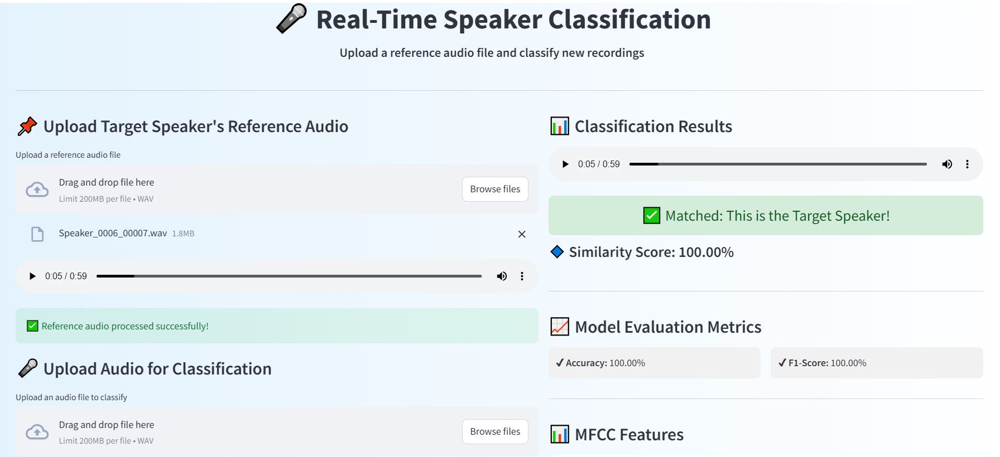
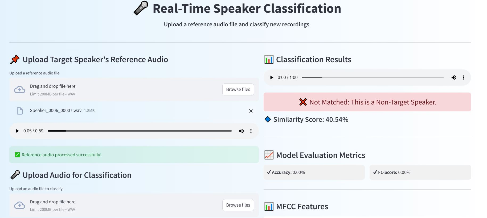
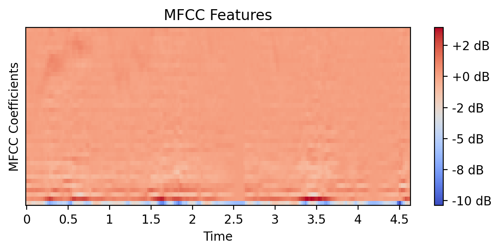

# 🎤 Speaker Verification System using Deep Learning


## 📌 Overview
This project implements a **Speaker Verification System** using **MFCC feature extraction**, **CNN-LSTM model**, and **Streamlit-based UI** for real-time speaker verification. The system classifies speakers based on their unique voice characteristics and predicts whether a new audio sample belongs to a known speaker.

---
## 🔥 Features
✅ **Extract MFCC features** from audio files<br>
✅ **Train a CNN-LSTM model** for speaker classification<br>
✅ **Evaluate model performance** using accuracy and F1-score<br>
✅ **Streamlit-based UI** for easy speaker verification<br>
✅ **Similarity score-based speaker identification** using cosine similarity

---

## 🛠️ Technologies Used
- **Python** 🐍
- **TensorFlow/Keras** 🔬
- **Librosa** 🎵
- **Streamlit** 🖥️
- **Scikit-Learn** 📊
- **Matplotlib** 📈


---
## 📂 Project Structure
```bash
📦 Speaker-Classification
├── 📁 dataset                        # Dataset folder containing audio samples
├── 📁 models                         # Trained models (saved as .h5 files)
├── 📁 streamlit_app                   # Streamlit UI implementation
├── 📝 README.md                      # Project documentation
├── 📄 train.py                        # Model training script
├── 📄 predict.py                      # Speaker prediction script
├── 📄 app.py                          # Streamlit application
└── 📄 requirements.txt                # Required dependencies
```

---
## 📌 Workflow
Below is a **flowchart** explaining the speaker classification workflow:



---
## 🔧 Installation
### 1️⃣ Clone the Repository
```bash
git clone https://github.com/your-username/speaker-classification.git
cd speaker-classification
```

### 2️⃣ Install Dependencies
```bash
pip install -r requirements.txt
```

### 3️⃣ Run Model Training
```bash
python train.py
```

### 4️⃣ Start Streamlit App
```bash
streamlit run app.py
```

---
## 🎯 Model Architecture
The model consists of:
- **Conv1D Layers** for extracting spatial features from MFCC
- **BatchNormalization & MaxPooling** for feature refinement
- **LSTM Layers** to capture time-series dependencies
- **Dense Layers** with Softmax activation for classification

---
## 📊 Results
Test 1:

<br>
Test 2:




## 🚀 Future Scope
- **Real-time Deployment:** Optimize the model for real-time applications, enabling instant speaker verification.  
- **Multi-Language Support:** Expand the dataset to include multiple languages and accents for better generalization.  
- **Noise Robustness:** Improve noise-handling capabilities by incorporating noise reduction techniques.  
- **Edge Computing Compatibility:** Deploy on edge devices like Raspberry Pi or mobile platforms for offline verification.  
- **Integration with Voice Assistants:** Enhance smart home assistants and security systems with speaker verification.  
- **Federated Learning:** Train models on decentralized user data while maintaining privacy and security.  
- **GANs for Data Augmentation:** Use Generative Adversarial Networks (GANs) to synthesize diverse speaker voices and enhance dataset diversity.  

---

## 📩 Contribution
🚀 Contributions are welcome! Feel free to fork and submit PRs.

---
## 📞 Contact
📧 **Email:** shubhamsingla259@gmail.com  


